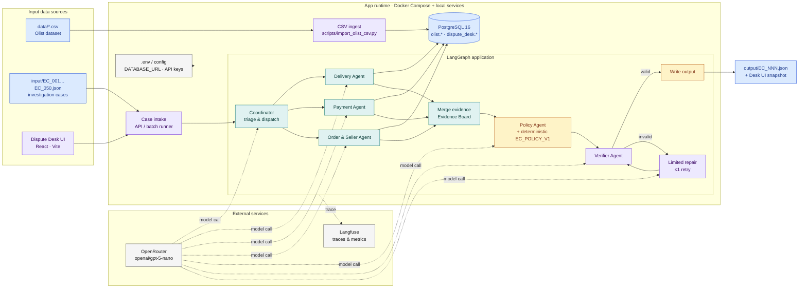
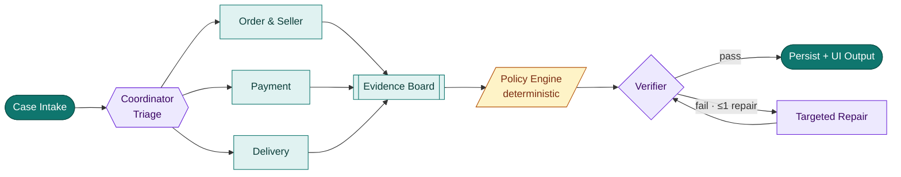
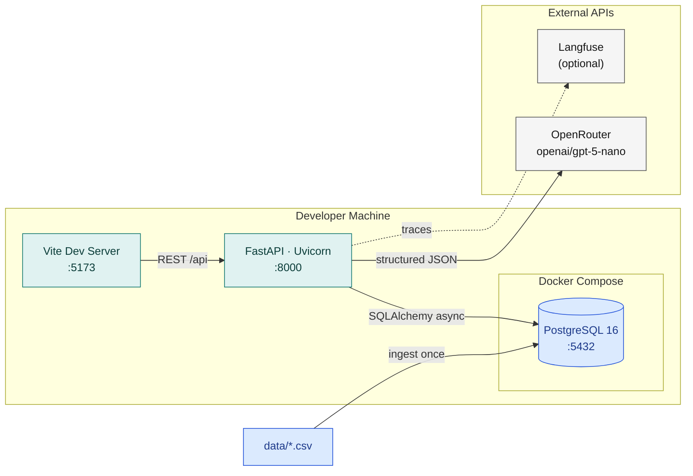
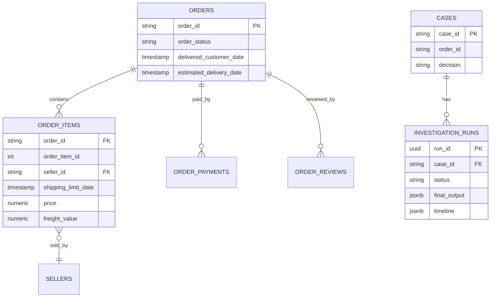
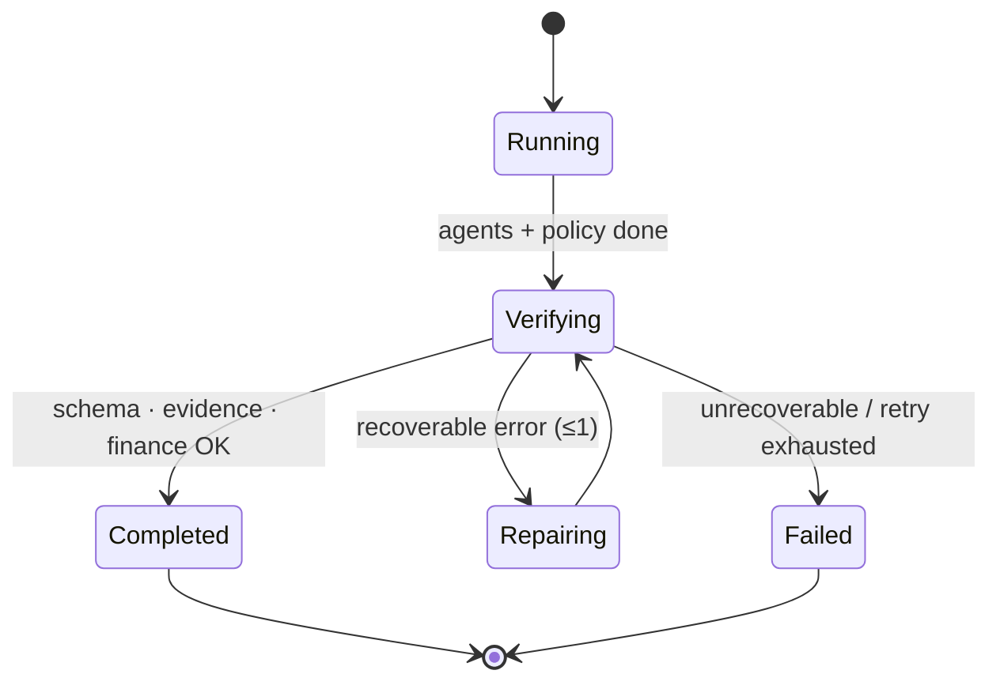

# Olist Dispute Desk

**Multi-agent e-commerce dispute investigation** with a deterministic refund policy and an internal ops console.

> Customer claims are not trusted by default. Agents investigate order / payment / delivery evidence from PostgreSQL, a policy engine computes refunds in code, and a verifier checks the result before it reaches the UI.

[](https://www.python.org/)
[](https://fastapi.tiangolo.com/)
[](https://vitejs.dev/)
[](https://langchain-ai.github.io/langgraph/)
[](https://www.postgresql.org/)
[](https://openrouter.ai/openai/gpt-5-nano)

---

## Features

- **Dispute Desk UI** — create cases from live Olist orders, run investigations, review evidence, approve / reject recommendations
- **Multi-agent pipeline** — Coordinator + Order/Seller, Payment, Delivery specialists in parallel
- **Deterministic policy** — refunds and actions come from `EC_POLICY_V1` code, not LLM arithmetic
- **Grounded evidence IDs** — only IDs that resolve to PostgreSQL records
- **Run history** — snapshots stored in `dispute_desk.*` tables (timeline, reports, final JSON)
- **Batch mode** — optional `input/EC_001.json` … `EC_050.json` via the CLI runner

---

## Architecture

### System overview

Layout mirrors the end-to-end investigation pipeline: ingest → multi-agent graph → verified JSON output.



### Multi-agent investigation flow



### Deployment (local Docker + services)



### Data model (persistence)



`olist.*` = read-only source of record. `dispute_desk.*` = app state written by the API.

### Verification state machine



### What the LLM may vs may not do

| Allowed (LLM) | Forbidden (LLM) |
| --- | --- |
| Understand customer claim / intent | Invent orders, payments, tracking events |
| Write short investigation narratives | Run arbitrary SQL |
| Soft review of policy wording | Compute refunds or money totals |
| Compact structured JSON responses | Override deterministic policy results |

PostgreSQL is the **system of record**. Money, timestamps, and refund decisions are **code-owned**.

---

## Tech stack

| Layer | Choice |
| --- | --- |
| Frontend | React, Vite, TypeScript |
| Backend API | FastAPI, Uvicorn |
| Orchestration | LangGraph |
| LLM gateway | OpenRouter → `openai/gpt-5-nano` |
| Database | PostgreSQL 16 + SQLAlchemy async / psycopg |
| Infra local | Docker Compose |
| Observability | Local `trace.jsonl` + optional Langfuse |
| Config | `.env` for secrets · model slug in source (`src/config/model_config.py`) |

---

## Policy (`EC_POLICY_V1`)

Priority order. Money rounded to 2 decimals. Payment match tolerance **±0.10 BRL**.

| Primary issue | Condition | Responsible party | Refund | Action |
| --- | --- | --- | ---: | --- |
| `canceled_order_paid` | `canceled` + payment > 0 | `platform` | payment total | `issue_full_refund` |
| `unavailable_order_paid` | `unavailable` + payment > 0 | `platform` | payment total | `issue_full_refund` |
| `late_delivery_seller` | delivered late + carrier after `shipping_limit_date` | `seller` | freight | `refund_freight` |
| `late_delivery_logistics` | delivered late + carrier on time | `logistics_provider` | freight | `refund_freight` |
| `valid_split_payment` | ≥2 payments, totals reconcile | — | 0 | `explain_valid_split_payment` |
| `unsupported_late_claim` | not late + payment OK | — | 0 | `reject_late_refund` |

### Evidence ID contract

```text
order:<order_id>
item:<order_id>:<order_item_id>
payment:<order_id>:<payment_sequential>
seller:<seller_id>
policy:<root_cause_code>
```

---

## Project structure

```text
├── frontend/                  # Dispute Desk (React + Vite)
├── src/
│   ├── api/                   # FastAPI surface
│   ├── agents/                # Coordinator + specialists + policy + verifier
│   ├── graph.py               # LangGraph wiring
│   ├── policy/                # Deterministic EC_POLICY_V1
│   ├── finance/               # Money calculator
│   ├── database/              # Models, repository, schema
│   ├── tools/                 # Allowlisted DB tools
│   ├── verification/          # Schema / evidence / financial checks
│   ├── llm/                   # OpenRouter client
│   └── observability/         # Trace + metadata
├── scripts/                   # ingest, run_api, validate, smoke
├── config/                    # policy + model registry
├── input/                     # EC_001 … EC_050 case JSON
├── data/                      # Olist CSV (not committed if large)
├── logging/                   # traces / metadata
└── architecture.md            # Deep design notes
```

---

## Quick start

### 1. Environment

```powershell
python -m venv .venv
.\.venv\Scripts\activate
pip install -e ".[dev]"

copy .env.example .env
# set OPENROUTER_API_KEY=...
```

### 2. Database

```powershell
docker start olist_disputes_db
# or: docker compose up -d postgres

.\.venv\Scripts\python.exe -m scripts.import_olist_csv --data-dir data
```

Ingest is a **CSV → SQL COPY** (not RAG chunking). Run once unless you refresh data.

### 3. Backend

```powershell
.\.venv\Scripts\python.exe scripts\run_api.py
```

- API: http://127.0.0.1:8000  
- Docs: http://127.0.0.1:8000/docs  

> On Windows, use `scripts/run_api.py` so psycopg gets a SelectorEventLoop.

### 4. Frontend

```powershell
cd frontend
npm.cmd install
npm.cmd run dev
```

- UI: http://127.0.0.1:5173  

### 5. Use the Desk

1. Open the UI  
2. **New case** → search/select an Olist `order_id` → write the customer claim  
3. **Create & run investigation**  
4. Wait for `completed`  
5. Review Assessment / Evidence / Agent reports / Timeline  
6. **Approve** or **Reject**

---

## API surface (MVP)

| Method | Path | Purpose |
| --- | --- | --- |
| `GET` | `/api/health` | Liveness + DB ping |
| `GET` | `/api/orders?search=` | Search Olist orders |
| `GET` | `/api/cases` | List desk cases |
| `POST` | `/api/cases` | Create case |
| `GET` | `/api/cases/{id}` | Case + runs |
| `POST` | `/api/cases/{id}/runs` | Start investigation |
| `GET` | `/api/runs/{run_id}` | Run snapshot |
| `POST` | `/api/cases/{id}/decision` | Approve / reject |

---

## Design principles

1. **Supervisor, not swarm** — handoffs go through the Coordinator / graph edges  
2. **Parallel specialists** — order, payment, delivery only read facts  
3. **Shared evidence board** — one place to merge grounded IDs and verified facts  
4. **Code owns money** — LLM never calculates refunds  
5. **Fail closed on verification** — invalid schema / evidence / finance does not ship as success  
6. **Secrets stay in `.env`** — model id stays in git for auditability  

More detail: [`architecture.md`](architecture.md)

---

## Data source

[Brazilian E-Commerce Public Dataset by Olist](https://www.kaggle.com/datasets/olistbr/brazilian-ecommerce)

---

## Roadmap

- [ ] Sample-case loader from `input/EC_*.json` in the UI  
- [ ] Live pipeline SSE / WebSocket progress  
- [ ] Lightweight auth for the desk  
- [ ] Deploy compose stack (API + UI + Postgres)

---

## License

Personal / educational project. Olist dataset retains its original license terms.
